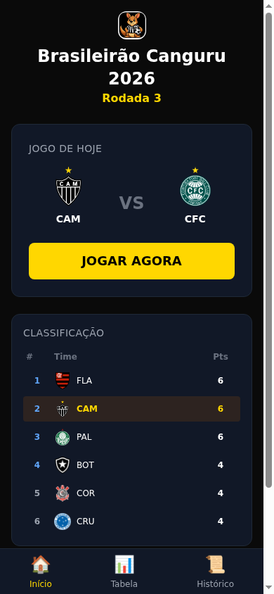
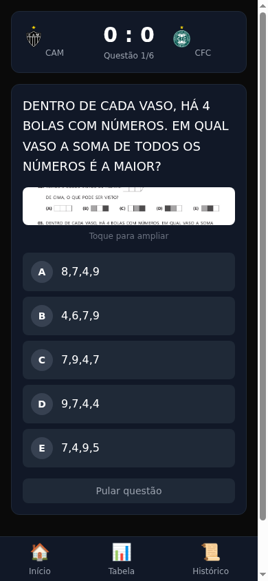
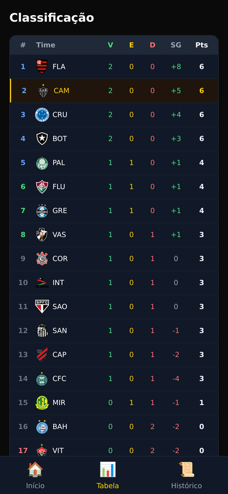
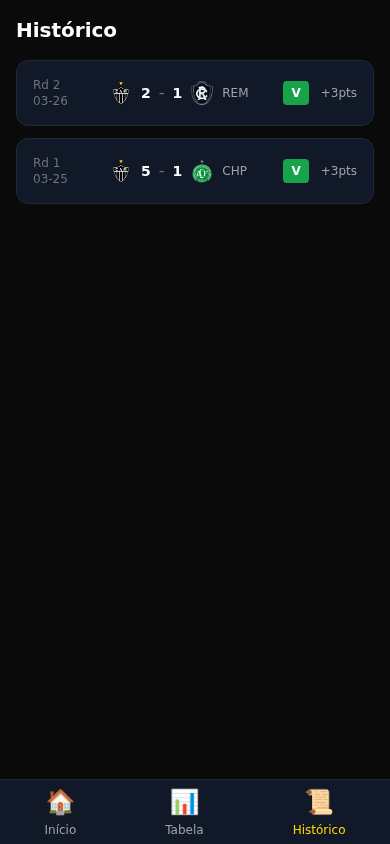
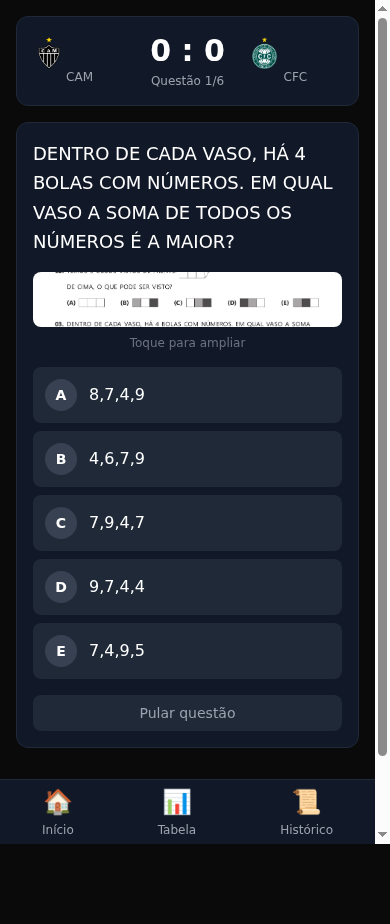

# 🦘⚽ Campeonato Canguru

A daily Brasileirão math quiz for Vitor. Play AS Atlético Mineiro against all 20 Serie A teams — answer Canguru de Matemática questions to score goals and win the championship.

## Screenshots

<div align="center">

| Home | Questão | Classificação | Histórico |
|:---:|:---:|:---:|:---:|
|  |  |  |  |
| Today's match + mini standings | Question card with image + answer options | Full 20-team Brasileirão table | All past match results |

</div>

The quiz uses real [Canguru de Matemática](https://cangurudematematica.org.br/) questions with original images. Tap the image thumbnail in-game to expand it.



## What It Is

Every day Vitor plays one match. Each question he answers correctly scores a goal for the Galo. Wrong answers and skips score nothing (no punishment — learning should feel like playing). The opponent's goals are simulated. Match results (W/D/L) accumulate into a full Brasileirão standings table across 38 rounds.

## How It Works

```
Vitor answers math question
        │
        ▼
Correct answer → ⚽ GOAL for Atlético Mineiro
Wrong / Skip   → no goal (no punishment)
        │
        ▼
After 6 questions → final score
        │
        ▼
W = +3pts · D = +1pt · L = 0pts
        │
        ▼
Saved to SQLite backend → standings update
```

**Question difficulty scales with opponent strength:**

| Opponent Strength | Easy | Medium | Hard | Examples |
|---|---|---|---|---|
| 1 (weakest) | 6 | 0 | 0 | Cuiabá, Criciúma, Vitória |
| 2 | 4 | 2 | 0 | Bragantino, Fortaleza, Bahia |
| 3 | 2 | 3 | 1 | São Paulo, Grêmio, Inter |
| 4 | 1 | 2 | 3 | Corinthians, Fluminense, Botafogo |
| 5 (hardest) | 0 | 2 | 4 | Palmeiras, Flamengo |

## Stack

### Frontend
- **Vite 5** + **React 18** + **TypeScript**
- **Tailwind CSS v3** — dark theme, Atlético Mineiro gold (#FFD700)
- **Zustand** — in-progress match state only (ephemeral)
- **react-router-dom v6**
- **framer-motion** — result screen entrance animations

### Backend
- **FastAPI** + **SQLite** (same pattern as galo-routine/calorie-accountant)
- **Port:** 3202
- **Service:** `campeonato-canguru.service` (systemd)

### Questions
Fetched from `rotinadoatleticano.duckdns.org/canguru/questions.json` — 120 Canguru Ecolier questions (2021–2025, level E, 5º/6º ano).

## Project Structure

```
campeonato-canguru/
├── src/                          # React frontend
│   ├── api/
│   │   └── client.ts             # API client (getState, getMatches, saveMatch, getStandings)
│   ├── components/
│   │   ├── GoalCelebration.tsx   # Full-screen goal/skip overlay
│   │   ├── MiniStandings.tsx     # Top-5 + CAM standings widget
│   │   ├── QuestionCard.tsx      # Question + options + image lightbox
│   │   ├── TeamBadge.tsx         # Consistent team badge image component
│   │   └── TimerBar.tsx          # (available but disabled — no time pressure)
│   ├── data/
│   │   ├── teams.ts              # 20 Serie A teams with strength ratings
│   │   └── schedule.ts           # Opponent rotation (19 teams, 2 rounds)
│   ├── pages/
│   │   ├── HomePage.tsx          # Today's match card + mini standings + stats
│   │   ├── MatchPage.tsx         # Active match: scoreboard + questions
│   │   ├── ResultPage.tsx        # Match result with framer-motion animation
│   │   ├── StandingsPage.tsx     # Full 20-team Brasileirão table
│   │   └── HistoryPage.tsx       # All past matches
│   ├── store/
│   │   └── championshipStore.ts  # Zustand store (in-progress match only)
│   └── utils/
│       ├── questions.ts          # Question selection by difficulty mix
│       └── scoring.ts            # Goal calc, result calc, simulation
│
├── backend/                      # FastAPI backend
│   ├── main.py                   # App entry, static file serving
│   ├── database.py               # SQLite init + context manager
│   ├── models.py                 # Pydantic schemas
│   ├── routers/
│   │   └── matches.py            # API endpoints
│   ├── utils/
│   │   └── standings.py          # 20-team standings computation
│   └── tests/
│       ├── test_api.py           # 21 endpoint tests
│       └── test_standings.py     # 17 logic unit tests
│
├── deploy.sh                     # Build + deploy to /root/campeonato-canguru/dist/
├── vite.config.ts
├── tailwind.config.js
└── index.html
```

## API

| Method | Path | Description |
|---|---|---|
| `GET` | `/status` | Health check |
| `GET` | `/api/state` | `{match_day, last_played_date, used_question_ids}` |
| `GET` | `/api/matches` | All completed matches, ordered by match_day |
| `POST` | `/api/matches` | Save a completed match |
| `GET` | `/api/standings` | Full 20-team championship table |

**Standings logic:**
- Atlético Mineiro = real match results from DB
- Other 19 teams = deterministic seeded simulation per match_day
- All other fixtures per round are simulated to keep the table alive

## Deploy

```bash
# Build frontend + deploy to service
bash deploy.sh

# Run tests
cd backend && python3 -m pytest tests/ -v

# Restart service
systemctl restart campeonato-canguru

# Logs
journalctl -u campeonato-canguru -f
```

## Data Persistence

All championship state lives in SQLite at `/root/campeonato-canguru/data/campeonato.db`. Survives browser clears, device switches, server reboots. One match per calendar day enforced server-side (`last_played_date` check).

## Team Badges

Real Serie A shields downloaded from Wikipedia Commons and TheSportsDB, served at `/teams/{team-id}.png`.
