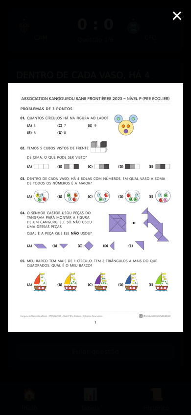

#  Campeonato Canguru

> A daily Brasileirão math quiz — answer Canguru de Matemática questions to score goals for Atlético Mineiro and win the championship.

---

## Screenshots

<div align="center">

| Home | Question | Full exam view | Standings | History |
|:---:|:---:|:---:|:---:|:---:|
|  |  |  |  |  |
| Today's match + mini standings | Question card with thumbnail | Tap image to see the full exam page | Full 20-team Brasileirão table | All past match results |

</div>

---

## Why I Built This

My son Vitor was preparing for the Canguru de Matemática — an international math competition for primary school students. The way you prepare is by working through past exam papers. Which is fine. But it feels like homework.

Vitor is an Atleticano. So I reframed the whole thing: instead of "do your maths practice", it's "play today's Galo match". Every correct answer scores a goal. The result — win, draw, loss — goes into a full Brasileirão standings table that runs across the school year. Harder opponents (Palmeiras, Flamengo) get harder questions. Easier opponents get easier ones. Vitor isn't grinding past papers. He's trying to win the championship.

The VPS made the rest possible: question banks from 5 years of official Canguru exams, all served locally, no subscription, no account. And since it runs on the same server as galo-routine, the two apps share the same Galo theme and the same idea — that the best way to get a kid to do something hard is to make it feel like being part of something they already love.

---

## Features

- **Daily match** — one match per day, 6 questions per match; can't replay the same day
- **No punishment** — wrong answers and skips score nothing; learning should feel like playing
- **Live standings** — Atlético's real results build a full 20-team Brasileirão table across 38 rounds; other teams are deterministically simulated to keep the table alive
- **Difficulty scaling** — question difficulty matches opponent strength (weakest teams = easy questions, Flamengo/Palmeiras = hardest)
- **Goal celebration** — full-screen animation on every correct answer
- **History** — all past match results with scores, opponents, and points earned
- **120 questions** — drawn from 5 years of official Canguru Ecolier exams (2021–2025, level E)
- **PWA** — installable on mobile, fullscreen standalone

---

## How It Works

```
Answer a math question
        │
        ▼
Correct → ⚽ GOAL for Atlético Mineiro
Wrong / Skip → no goal (no punishment)
        │
        ▼
After 6 questions → final score
        │
        ▼
W = +3pts · D = +1pt · L = 0pts
        │
        ▼
Saved to SQLite backend → standings update
```

**Question difficulty scales with opponent strength:**

| Opponent Strength | Easy | Medium | Hard | Examples |
|---|---|---|---|---|
| 1 (weakest) | 6 | 0 | 0 | Cuiabá, Criciúma, Vitória |
| 2 | 4 | 2 | 0 | Bragantino, Fortaleza, Bahia |
| 3 | 2 | 3 | 1 | São Paulo, Grêmio, Inter |
| 4 | 1 | 2 | 3 | Corinthians, Fluminense, Botafogo |
| 5 (hardest) | 0 | 2 | 4 | Palmeiras, Flamengo |

---

## Stack

| Layer | Tech |
|---|---|
| Frontend | Vite 5, React 18, TypeScript |
| Styling | Tailwind CSS v3 — dark theme, Atlético Mineiro gold (#FFD700) |
| State | Zustand — in-progress match state only (ephemeral) |
| Routing | react-router-dom v6 |
| Animation | framer-motion — result screen entrance animations |
| Backend | FastAPI + SQLite |
| Port | 3202 |
| Questions | 120 Ecolier questions from Canguru de Matemática (2021–2025, level E, 5th/6th grade) |

---

## Architecture

```
┌──────────┐       ┌──────────────┐       ┌──────────┐
│  Browser │──────▶│   FastAPI     │──────▶│  SQLite  │
│  (React) │◀──────│   :3202      │◀──────│  (WAL)   │
└──────────┘       └──────────────┘       └──────────┘
     PWA            Serves dist/          data/campeonato.db
```

| Component | Path | Description |
|---|---|---|
| **React frontend** | `src/` | Pages (Home, Match, Result, Standings, History), Zustand store, API client, components (QuestionCard, GoalCelebration, MiniStandings, TeamBadge, TimerBar) |
| **Data layer** | `src/data/` | 20 Série A teams with strength ratings, opponent rotation schedule (19 teams, 2 rounds) |
| **Utilities** | `src/utils/` | Question selection by difficulty mix, goal/result calculation, simulation |
| **FastAPI app** | `backend/main.py` | App entry, static file serving, SPA catch-all route |
| **Database** | `backend/database.py` | SQLite init + context manager (WAL mode) |
| **Models** | `backend/models.py` | Pydantic schemas (MatchCreate, MatchOut, TeamStanding, AppState) |
| **API routes** | `backend/routers/matches.py` | Endpoints: state, matches, standings, questions proxy, health check |
| **Standings** | `backend/utils/standings.py` | 20-team standings — real results for Atlético MG, deterministic simulation for other teams |
| **Tests** | `backend/tests/` | 38 tests covering API endpoints and standings logic |
| **Database file** | `data/campeonato.db` | Single `matches` table: id, match_day, date, opponent_id, cam_goals, opp_goals, result, points, answers (JSON), created_at |

---

## Self-hosting

### Requirements

- Python 3.10+
- Node.js 18+

### Quick start

```bash
git clone https://github.com/andrepaim/campeonato-canguru.git
cd campeonato-canguru

# Backend dependencies
pip install -r requirements.txt

# Build frontend
npm install
npm run build          # outputs to dist/

# Run
cd backend
python3 -m uvicorn main:app --host 127.0.0.1 --port 3202
```

The app will be available at `http://localhost:3202`. The backend serves the built frontend from `dist/` as static files.

### Environment variables

None required. All configuration is hardcoded (port 3202, database path relative to `backend/`).

### Development

**Backend** — run with auto-reload:

```bash
cd backend
python3 -m uvicorn main:app --host 127.0.0.1 --port 3202 --reload
```

**Frontend** — run the Vite dev server (proxies `/api` and `/teams` to the backend at `:3202`):

```bash
npm run dev
```

### Deploy (systemd)

Create `/etc/systemd/system/campeonato-canguru.service`:

```ini
[Unit]
Description=Campeonato Canguru
After=network.target

[Service]
Type=simple
User=openclaw
Group=openclaw
WorkingDirectory=/home/openclaw/campeonato-canguru/backend
ExecStart=/usr/bin/python3 -m uvicorn main:app --host 0.0.0.0 --port 3202
Restart=always
RestartSec=5

[Install]
WantedBy=multi-user.target
```

Build and restart:

```bash
npm run build
sudo systemctl restart campeonato-canguru
```

---

## Tests

```bash
cd backend && python3 -m pytest tests/ -v
# 38 tests, ~0.8s
```

---

## License

MIT
